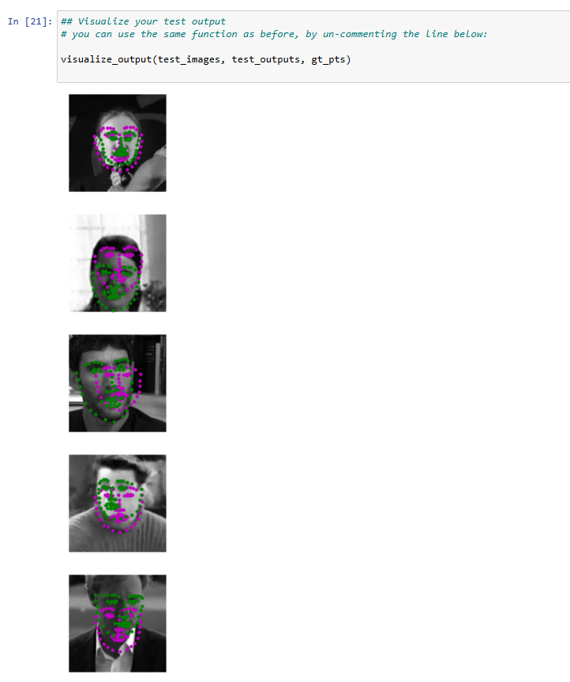
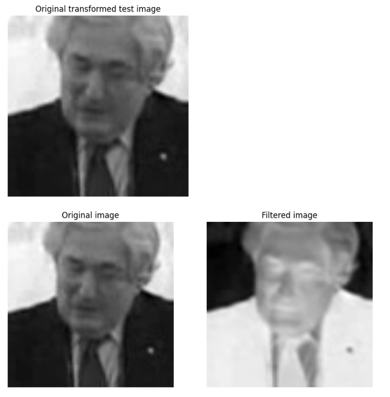
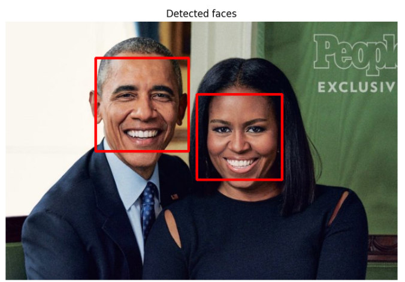

# Detección de Puntos Clave Faciales

Proyecto de visión por computadora y deep learning para detectar rostros en imágenes y predecir la posición de **68 puntos clave faciales** alrededor de ojos, nariz, boca y contorno facial.

El sistema combina un detector clásico de rostros basado en **Haar Cascade** con una red neuronal convolucional (**CNN**) implementada en **PyTorch**. El flujo completo permite cargar una imagen, detectar los rostros presentes, preprocesar cada rostro y predecir sus puntos clave faciales.

---

## Vista general del proyecto

El objetivo del proyecto es construir un pipeline completo capaz de:

1. Cargar y visualizar imágenes faciales.
2. Aplicar transformaciones de preprocesamiento a las imágenes.
3. Definir y entrenar una red neuronal convolucional para regresión de puntos clave.
4. Guardar el modelo entrenado.
5. Detectar rostros en imágenes nuevas mediante Haar Cascade.
6. Predecir y visualizar los 68 puntos clave faciales sobre cada rostro detectado.

Este proyecto corresponde a un ejercicio práctico de visión por computadora donde se combinan técnicas tradicionales de OpenCV con modelos de aprendizaje profundo.

---

## Tecnologías utilizadas

- Python
- PyTorch
- OpenCV
- NumPy
- Matplotlib
- Pandas
- Jupyter Notebook
- Haar Cascade Classifier
- Convolutional Neural Networks

---

## Estructura del proyecto

```text
Vision-por-computadora/
│
├── 1. Load and Visualize Data.ipynb
├── 2. Define the Network Architecture.ipynb
├── 3. Facial Keypoint Detection, Complete Pipeline.ipynb
├── 4. Fun Filters and Keypoint Uses.ipynb
│
├── models.py
├── data_load.py
├── workspace_utils.py
│
├── saved_models/
│   └── keypoints_model_1.pt
│
├── detector_architectures/
│   └── haarcascade_frontalface_default.xml
│
├── images/
├── data/
│
└── screenshots/
    ├── Detected_faces.png
    ├── Facial_keypoints_detected_on_original_image.png
    ├── Filter_image.png
    └── Visualize_test.png
```

> Nota: algunos archivos o carpetas pueden variar dependiendo del entorno utilizado para ejecutar el proyecto.

---

## Dataset y preprocesamiento

El dataset contiene imágenes faciales junto con las coordenadas de 68 puntos clave por rostro. Cada punto clave está representado por un par de coordenadas `(x, y)`.

Durante el preprocesamiento se aplican las siguientes transformaciones:

- Reescalado de la imagen.
- Recorte aleatorio a tamaño cuadrado.
- Conversión a escala de grises.
- Normalización de píxeles al rango `[0, 1]`.
- Normalización de coordenadas de puntos clave.
- Conversión a tensores de PyTorch.

La transformación principal utilizada fue:

```python
data_transform = transforms.Compose([
    Rescale(250),
    RandomCrop(224),
    Normalize(),
    ToTensor()
])
```

---

## Arquitectura del modelo

La red neuronal convolucional se define en `models.py` mediante la clase `Net`.

La CNN recibe como entrada imágenes en escala de grises de tamaño `224 x 224` y devuelve **136 valores**, correspondientes a:

```text
68 puntos clave x 2 coordenadas = 136 salidas
```

La arquitectura incluye:

- 4 capas convolucionales.
- Funciones de activación ReLU.
- Capas de max pooling.
- Dropout para reducir overfitting.
- Capas fully connected.
- Salida final de 136 valores.

---

## Entrenamiento

El problema se trata como una tarea de **regresión**, ya que el modelo predice coordenadas continuas.

Para el entrenamiento se utilizó:

```python
criterion = nn.SmoothL1Loss()
optimizer = optim.Adam(net.parameters(), lr=0.001)
```

La función `SmoothL1Loss` es adecuada porque compara coordenadas predichas con coordenadas reales y es menos sensible a outliers que una pérdida MSE tradicional.

El optimizador `Adam` se utilizó por su capacidad de adaptar la tasa de aprendizaje durante el entrenamiento y su buen rendimiento habitual en redes convolucionales.

---

## Resultados visuales

### Visualización de predicciones en test

La siguiente imagen muestra ejemplos de predicción de puntos clave sobre imágenes del conjunto de test.



---

### Visualización de filtros aprendidos

También se extrajo un filtro convolucional aprendido por la primera capa de la CNN y se aplicó sobre una imagen de test. Esto permite observar qué tipo de características empieza a detectar la red, como bordes, cambios de contraste y estructuras faciales locales.



---

### Detección de rostros con Haar Cascade

Antes de aplicar la CNN sobre imágenes nuevas, se utiliza un clasificador Haar Cascade para detectar las regiones faciales.



---

### Pipeline completo de detección de puntos clave

Una vez detectados los rostros, cada región facial se transforma a escala de grises, se normaliza, se redimensiona a `224 x 224` y se pasa por la CNN entrenada para obtener los puntos clave.


---

## Pipeline final

El flujo completo del sistema es:

```text
Imagen de entrada
        ↓
Detección de rostros con Haar Cascade
        ↓
Recorte de cada rostro detectado
        ↓
Conversión a escala de grises
        ↓
Normalización y redimensionado a 224x224
        ↓
Conversión a tensor PyTorch
        ↓
Predicción con CNN entrenada
        ↓
Visualización de 68 puntos clave faciales
```

---

## Cómo ejecutar el proyecto

### 1. Clonar el repositorio

```bash
git clone <URL_DEL_REPOSITORIO>
cd Vision-por-computadora
```

### 2. Crear un entorno virtual

En Windows PowerShell:

```powershell
python -m venv .venv
.\.venv\Scripts\Activate.ps1
```

### 3. Instalar dependencias

```bash
pip install torch torchvision numpy pandas matplotlib opencv-python jupyter
```

### 4. Abrir Jupyter Notebook

```bash
jupyter notebook
```

### 5. Ejecutar los notebooks principales

Ejecutar en este orden:

```text
2. Define the Network Architecture.ipynb
3. Facial Keypoint Detection, Complete Pipeline.ipynb
```

---

## Archivos principales evaluados

Los archivos principales del proyecto son:

- `models.py`: contiene la arquitectura CNN.
- `2. Define the Network Architecture.ipynb`: define transformaciones, entrenamiento, evaluación y visualización de filtros.
- `3. Facial Keypoint Detection, Complete Pipeline.ipynb`: implementa el pipeline completo de detección facial y predicción de keypoints.

---

## Aprendizajes principales

Este proyecto permitió practicar y consolidar conceptos como:

- Preprocesamiento de imágenes para deep learning.
- Construcción de datasets personalizados en PyTorch.
- Definición de arquitecturas CNN.
- Entrenamiento de modelos para regresión.
- Detección de rostros con OpenCV.
- Visualización de filtros convolucionales.
- Integración de modelos entrenados en un pipeline completo.

---

## Posibles mejoras futuras

Algunas mejoras que podrían añadirse en futuras versiones son:

- Entrenar durante más épocas para mejorar la precisión.
- Añadir data augmentation con rotaciones, cambios de iluminación y escalado.
- Probar arquitecturas CNN más profundas.
- Usar modelos preentrenados como base.
- Implementar filtros faciales interactivos.
- Detectar sonrisas o expresiones a partir de los puntos clave.
- Aplicar el sistema sobre vídeo en tiempo real.

---

## Autor

**Jose Luis Lazaro Contreras**

Proyecto de visión por computadora centrado en la detección de puntos clave faciales mediante técnicas de OpenCV y redes neuronales convolucionales en PyTorch.

